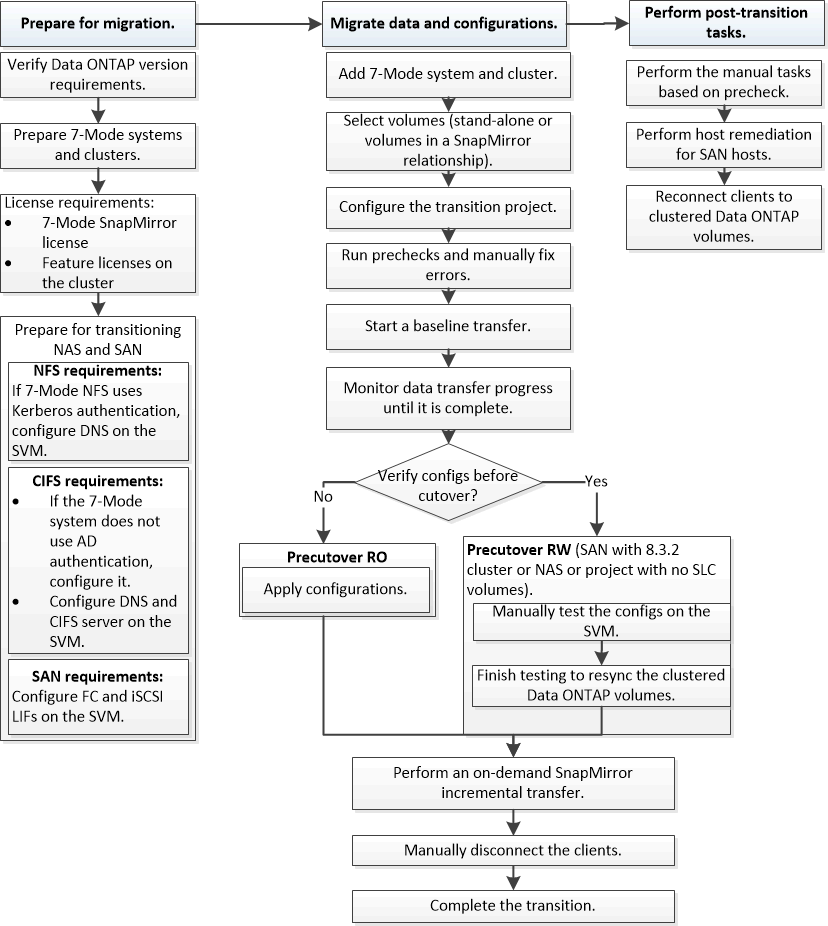

= Copy-based transition workflow
:icons: font
:imagesdir: ../media/

[.lead]
The copy-based transition workflow involves preparing for migration, migrating data and configurations, and performing post-transition configurations.

