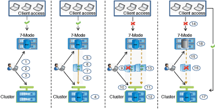

= How you transition a stand-alone volume
:icons: font
:imagesdir: ../media/

[.lead]
Transitioning a stand-alone volume includes different phases: preparation, data copy, apply configuration (precutover), and storage cutover. After completing transition, you must perform some post-transition steps before resuming client access. Understanding what occurs during each phase helps you manage your transition efficiently.

|===
| Phase| Steps
a|
Preparation
a|

. Gathering information
. Performing the precheck
. Creating data copy schedules

a|
Data copy
a|

. Creating the ONTAP volumes as read-only
. Creating a transition peer relationship
. Establishing a SnapMirror relationship
. Performing a baseline transfer
. Performing scheduled incremental updates

a|
Precutover
a|

. Breaking the SnapMirror relationship
. Applying configurations to the SVM
. Configuring data LIFs on the SVM
. Testing data and configurations (manual and only for precutover RW)
. Resynchronizing ONTAP volumes with corresponding 7-Mode volumes

a|
Storage cutover
a|

. Disconnecting client access (manual)
. Performing a final SnapMirror update
. Breaking the SnapMirror relationship
. Removing 7-Mode IP addresses and setting the data LIFs to the up state on the SVM
. Taking the source volume offline

After cutover, performing post-transition steps and enabling client access (manual)

a|
Chain of Custody verification for SnapLock volumes
a|

. Enumerating all of the WORM files from 7-Mode volumes
. Calculating the fingerprint for each WORM file on the 7-Mode volumes (enumerated in the previous step) and calculating the fingerprint for the corresponding WORM file on the transitioned ONTAP volumes
. Generating a report with details about the number of files with matched and unmatched fingerprints, and the reason for the mismatch

|===

== Preparation phase

In this phase, information about the 7-Mode system and the cluster, volumes, and IP addresses is collected. The 7-Mode Transition Tool performs the following tasks in this phase:

. Collects and adds 7-Mode storage system and volume information.
. Runs the transition precheck.
. Collects and adds cluster, SVM, and aggregate information.
. Collects IP addresses that must be configured on the SVM:
 ** Selects the IP addresses that exist on the 7-Mode system.
 ** Specifies new IP addresses that must be configured on the SVM.
*Note:* Transitioning of iSCSI and FC LIFs (SAN) is not supported by the tool. You must manually configure SAN LIFs on the SVM before transition.
. Creates data copy schedules for baseline copy and incremental updates.
. If the project contains SnapLock volumes, collects information about the read-write SnapLock volumes for which Chain of Custody verification is required and the details of the ONTAP volume that stores the fingerprint data that is generated during the Chain of Custody verification operation.
+
NOTE: The Chain of Custody verification operation is supported only for volumes with file names that have only ASCII characters.

. Plans configuration transition by selecting the 7-Mode configurations that must be transitioned to the target SVM and target volumes.

You should not modify the objects (volumes, IP addresses, system information, and so on) on the controller after fixing the errors and warnings that are reported during the precheck.

== Data copy phase

In this phase, data from the 7-Mode volumes is copied to the ONTAP volumes. The 7-Mode Transition Tool performs the following tasks in this phase:

. Creates the ONTAP volumes with read-only access.
. Set up a transition peer relationship between the 7-Mode system and the SVM.
. Establishes a transition SnapMirror relationship (relationship of type TDP) between the 7-Mode volumes and ONTAP volumes.
. Completes the baseline data copy transfer based on schedule inputs.
. Performs scheduled incremental updates to the ONTAP volumes.

== Apply configuration (precutover) phase

It is a best practice to run precutover operation a few days or weeks before the planned cutover window. This activity is to verify whether all the configurations are applied properly and whether any changes are required.

In this phase, configurations from the 7-Mode volumes are copied to ONTAP volumes.

There are two modes for the apply configuration (precutover) phase: *precutover read-only* and *precutover read/write*.

The precutover read/write mode is not supported when the project contains:

* SAN volumes and the target cluster is running Data ONTAP 8.3.1 or earlier
+
In this situation, the following configurations are not applied in the apply configuration (precutover) phase. Instead, they are applied during the cutover phase.

 ** SAN configurations
 ** Snapshot Schedule configurations

* SnapLock Compliance volumes
+
If the project contains SnapLock Compliance volumes, then the Snapshot Schedule configurations are not applied in the apply configuration (precutover) phase. Instead, these configurations are applied during the cutover phase.
+
xref:concept_considerations_for_transitioning_of_snaplock_compliance_volumes.adoc[Considerations for transitioning of SnapLock Compliance volumes]

If the target cluster is running Data ONTAP 8.3.1 or earlier, and you want to run the apply configuration (precutover) operation in read/write mode for NAS volumes, then you must create separate projects for the NAS volumes and SAN volumes. This action is required because the precutover read/write mode is not supported if you have SAN volumes in your project.

If the project contains SnapLock Compliance volumes, and you want to run the apply configuration (precutover) operation in read/write mode for non-SnapLock Compliance volumes, then you must create separate projects for SnapLock Compliance volumes and non-SnapLock Compliance volumes. This action is required because the precutover read/write mode is not supported if you have SnapLock Compliance volumes in your project.

The tool performs the following steps in the *precutover read-only mode*:

. Performs an incremental update from 7-Mode volumes to ONTAP volumes.
. Breaks the SnapMirror relationship between 7-Mode volumes and ONTAP volumes.
+
NOTE: For SnapLock Compliance volumes, the SnapMirror relationship between the 7-Mode volume and ONTAP volumes is not broken. The SnapMirror relationship is not broken because the SnapMirror resynchronization operation between 7-Mode and ONTAP volumes is not supported for SnapLock Compliance volumes.

. Collects configurations from 7-Mode volumes, and applies the configurations to the ONTAP volumes and the SVM.
. Configures the data LIFs on the SVM:
 ** Existing 7-Mode IP addresses are created on the SVM in the administrative down state.
 ** New IP addresses are created on the SVM in the administrative up state.
. Resynchronizes the SnapMirror relationship between 7-Mode volumes and ONTAP volumes

The tool performs the following steps in the *precutover read/write mode*:

. Performs an incremental update from 7-Mode volumes to ONTAP volumes.
. Breaks the SnapMirror relationship between 7-Mode volumes and ONTAP volumes.
. Collects configurations from 7-Mode volumes, and applying the configurations to the ONTAP volumes and the SVM.
. Configures the data LIFs on the SVM:
 ** Existing 7-Mode IP addresses are created on the SVM in the administrative down state.
 ** New IP addresses are created on the SVM in the administrative up state.
. Makes the ONTAP volumes available for read/write access.
+
After you apply the configuration, the ONTAP volumes are available for read/write access so that read/write data access can be tested on these volumes during apply configuration (precutover) testing. You can manually verify the configurations and data access in ONTAP.

. Resynchronizes the ONTAP volumes when "finish testing" operation is triggered manually.

== Storage cutover phase

The 7-Mode Transition Tool performs the following tasks in this phase:

. Optional: Performs an on-demand SnapMirror update to reduce the downtime after cutover.
. Manual: Disconnect client access from the 7-Mode system.
. Performs a final SnapMirror update from 7-Mode volumes to ONTAP volumes.
. Breaks and deletes the SnapMirror relationship between the 7-Mode volumes to ONTAP volumes, making the ONTAP volumes read/write.
+
If the selected volume is a SnapLock Compliance volume and the volume is the destination of a SnapMirror relationship, then the SnapMirror relationship between the 7-Mode volume and the ONTAP volume is deleted without a SnapMirror break operation. This action is performed to ensure that secondary ONTAP SnapLock Compliance volumes remain in read-only mode. The secondary ONTAP SnapLock Compliance volumes must be in read-only mode for the resynchronization operation to be successful between the primary and secondary SnapLock Compliance volumes.

. Applies Snapshot schedules configuration if:
 ** The target cluster is running clustered Data ONTAP 8.3.0 or 8.3.1 and project contains SAN volumes.
 ** The project contains SnapLock compliance volumes.
. Applies SAN configurations, if the target cluster is running Data ONTAP 8.3.1 or earlier.
. Applies quota configurations, if any.
. Removes the existing 7-Mode IP addresses selected for transition from the 7-Mode system and brings the data LIFs on the SVM to the administrative up state.
+
NOTE: SAN LIFs are not transitioned by the 7-Mode Transition Tool.

. Optional: Takes the 7-Mode volumes offline.

== Chain of Custody verification process for SnapLock volumes

You must perform the Chain of Custody verification operation. The tool performs the following operations when a Chain of Custody verification is initiated:

. Enumerates all of the WORM files from 7-Mode volumes.
. Calculates the fingerprint for each WORM file on the 7-Mode volumes (enumerated in the previous step) and calculates the fingerprint for the corresponding WORM file on the transitioned ONTAP volumes.
. Generates a report with details about the number of files with matched and unmatched fingerprints, and the reason for the mismatch.

NOTE:

* The Chain of Custody verification operation is supported only for read-write SnapLock volumes that have file names with only ASCII characters.
* This operation can take a significant amount of time based on the number of files on the 7-Mode SnapLock volumes.

== Post-transition steps

After the storage cutover phase finishes successfully and the transition is completed, you must perform some post-transition manual tasks:

. Perform the required steps to configure features that were not transitioned or were partially transitioned, as listed in the precheck report.
+
For example, IPv6 and FPolicy must be configured manually after transition.

. For SAN transition, reconfigure the hosts.
+
http://docs.netapp.com/ontap-9/topic/com.netapp.doc.dot-7mtt-sanspl/home.html[SAN host transition and remediation]

. Ensure that the SVM is ready to serve data to the clients by verifying the following:
 ** The volumes on the SVM are online and read/write.
 ** The IP addresses are up and reachable on the SVM.
. Redirect client access to the ONTAP volumes.

*Related information*

xref:task_transitioning_volumes_using_7mtt.adoc[Migrating data and configuration from 7-Mode volumes]
