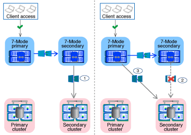
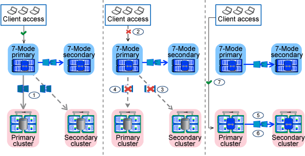

= How you transition volumes in a SnapMirror relationship
:icons: font
:imagesdir: ../media/

[.lead]
If you want to transition 7-Mode volumes that are in a SnapMirror relationship, the secondary volumes must be transitioned first. Then, a volume SnapMirror relationship is established between the 7-Mode primary volumes and ONTAP secondary volumes.

After transitioning the primary volumes, the 7-Mode Transition Tool establishes a volume SnapMirror relationship between ONTAP primary and secondary volumes.

NOTE: The 7-Mode Transition Tool does not automatically transition SnapLock Compliance volumes that are in a SnapMirror relationship. All SnapLock Compliance volumes that are in a SnapMirror relationship must be transitioned as stand-alone volumes. After the primary and secondary SnapLock Compliance volumes are transitioned to ONTAP, you must manually perform the SnapMirror resynchronization operation between these volumes.

You can perform precheck, baseline copy, incremental transfers, and apply configuration (precutover) on the secondary and primary projects simultaneously; however, the storage cutover for the secondary project must be performed first.

== Preparation phase

In this phase, the 7-Mode system, cluster, volumes, and IP addresses are selected. The 7-Mode Transition Tool performs the following tasks in this phase:

. Adds 7-Mode storage system and volume information
. Gathers information about 7-Mode source volumes and SnapMirror relationships:
 ** For transitioning a secondary volume, collecting information about the 7-Mode primary system
 ** For transitioning a primary volume, collecting information about the 7-Mode secondary system
. Runs the transition precheck
. Adds cluster, SVM, and aggregate information
. Collects IP addresses that must be configured on the SVM:
 ** Selecting IP addresses that exist on the 7-Mode system
 ** Specifying new IP addresses that must be configured on the SVM
+
NOTE: Transitioning iSCSI and FC LIFs (SAN) is not supported by the tool. You must manually configure the SAN LIFs on the SVM before transition.
. Creates the data copy schedules for baseline and incremental transfers.
. If the project contains SnapLock volumes, collects information about the read-write SnapLock volumes for which Chain of Custody verification is required and details about the ONTAP volume that stores the fingerprint data generated during the Chain of Custody verification operation.
+
NOTE: The SnapLock Chain of Custody verification is supported only for read/write 7-Mode SnapLock volumes. It is not supported for read-only volumes. The SnapLock Chain of Custody verification is not supported for SnapLock volumes containing files that have names with non-ASCII characters.

. Plans the configuration transition by selecting the 7-Mode configurations that must be transitioned to target SVM and target volumes.

You must not modify the objects (volumes, IP addresses, system information, and so on) on the controller after fixing errors and warnings that are reported by the precheck.

== Data copy phase

In this phase, data from the 7-Mode volumes is copied to the ONTAP volumes. The 7-Mode Transition Tool performs the following tasks in this phase:

. Creates the ONTAP volumes with read-only access
. Set up a transition peer relationship between the 7-Mode system and the SVM
. Establishes a SnapMirror relationship between the 7-Mode volumes and ONTAP volumes
. Completes the baseline data transfer based on schedule inputs
. Performs scheduled SnapMirror data copy updates to the ONTAP volumes

== Apply configuration (precutover) phase

It is a best practice to run *Apply configuration* a few days or weeks before the planned cutover window. This precheck enables you to have enough time to verify that all of the configurations are applied properly and whether any changes are required.

In this phase, configurations from the 7-Mode volumes are copied to the ONTAP volumes.

There are two modes for the apply configuration (precutover) phase: precutover read-only and precutover read/write.

The precutover read/write mode is not supported when the project contains the following:

* SAN volumes and the target cluster is running Data ONTAP 8.3.1 or earlier
+
In this situation, the following configurations are not applied in the apply configuration (precutover) phase, instead they are applied during the cutover phase:

 ** SAN configurations
 ** Snapshot schedule configurations

* SnapLock Compliance volumes
+
If the project contains SnapLock Compliance volumes, then the Snapshot schedule configurations are not applied in the apply configuration (precutover) phase. Instead, these configurations are applied during the cutover phase.
+
xref:concept_considerations_for_transitioning_of_snaplock_compliance_volumes.adoc[Considerations for transitioning of SnapLock Compliance volumes].

If the target cluster is running Data ONTAP 8.3.1 or earlier and you want to run the apply configuration (precutover) operation in read/write mode for NAS volumes, then you must create separate projects for the NAS and SAN volumes. This action is required because the apply configuration (precutover) read/write mode is not supported if you have SAN volumes in your project.

If the project contains SnapLock Compliance volumes and you want to run the apply configuration (precutover) operation in read/write mode for non-SnapLock Compliance volumes, then you must create separate projects for SnapLock Compliance volumes and non-SnapLock Compliance volumes. This action is required because the apply configuration (precutover) read/write mode is not supported if you have SnapLock Compliance volumes in your project.

The following steps are performed by the tool in the *precutover read-only mode*:

. Performs an incremental update from 7-Mode volumes to ONTAP volumes
. Breaks the SnapMirror relationship between 7-Mode volumes and ONTAP volumes
+
NOTE: For SnapLock Compliance volumes, the SnapMirror relationship between the 7-Mode volume and ONTAP volumes is not broken. This is because the SnapMirror resynchronization operation between 7-Mode and ONTAP volumes is not supported for SnapLock Compliance volumes.

. Collects configurations from 7-Mode volumes and applying the configurations to the ONTAP volumes and SVM
. Configures the data LIFs on the SVM:
 ** Existing 7-Mode IP addresses are created on the SVM in the administrative down state.
 ** New IP addresses are created on the SVM in the administrative up state.
. Resynchronizes the SnapMirror relationship between 7-Mode volumes and ONTAP volumes

The following steps are performed in the *precutover read/write mode*:

. Performs an incremental update from 7-Mode volumes to ONTAP volumes
. Breaks the SnapMirror relationship between 7-Mode volumes and ONTAP volumes
. Collects configurations from 7-Mode volumes and applying the configurations to the ONTAP volumes and SVM
. Configures the data LIFs on the SVM:
 ** Existing 7-Mode IP addresses are created on the SVM in the administrative down state.
 ** New IP addresses are created on the SVM in the administrative up state.
. Tests the read/write data access on the ONTAP volumes during apply configuration (precutover) testing
+
These ONTAP volumes will be available for read/write access after you apply the configuration. After you apply the configuration, the ONTAP volumes are available for read/write access so that read/write data access can be tested on these volumes during apply configuration (precutover) testing.

. Manual: Verifying the configurations and data access in ONTAP
. Manual: Finish testing
+
The ONTAP volumes are resynchronized.

== Storage cutover (secondary volumes) phase

The following illustration depicts the transition of a secondary volume:

[options="header"]
|===
| Phase| Steps
a|
Storage cutover (secondary volumes)
a|

. Transitioning the secondary volumes
. Breaking and deleting SnapMirror relationship between the secondary volumes
. Establishing a DR relationship between the 7-Mode primary and ONTAP secondary volumes

|===
The 7-Mode Transition Tool performs the following tasks in this phase:

. Optional: Performs an on-demand SnapMirror update on the ONTAP secondary volumes
. Manual: Disconnecting client access, if required
. Performs a final SnapMirror update from the 7-Mode secondary volume to the ONTAP secondary volume
. Breaks and deletes the SnapMirror relationship between the 7-Mode secondary volume and the ONTAP secondary volume, and making the destination volumes read/write
. Applies the Snapshot schedules configuration, if the target cluster is running Data ONTAP 8.3.0 or 8.3.1 and the project contains SAN volumes
. Applies SAN configurations, if the target cluster is running Data ONTAP 8.3.1 or earlier
+
NOTE: All of the required igroups are created during this operation. For the secondary volumes, mapping LUNs to igroups is not supported during the cutover operation. You must manually map the secondary LUNs after completing the storage cutover operation of the primary volumes. However, for stand-alone volumes included in the secondary project, LUNs are mapped to the igroups during this operation.

. Applies quota configurations, if any
. Establishes a SnapMirror relationship between the volumes on the 7-Mode primary system and the ONTAP secondary volumes
+
The SnapMirror schedule that is used to update the SnapMirror relationships between the 7-Mode primary volumes and 7-Mode secondary volumes is applied to the SnapMirror relationships between the 7-Mode primary volumes and ONTAP secondary volumes.

. Removes the existing 7-Mode IP addresses selected for transition from the 7-Mode system and bringing the data LIFs on the SVM to the administrative up state
+
NOTE: SAN LIFs are not transitioned by the 7-Mode Transition Tool.

. Optional: Taking the 7-Mode volumes offline

== Storage cutover (primary volumes) phase

The following illustration depicts the transition of a primary volume:

[options="header"]
|===
| Phase| Steps
a|
Storage cutover (primary volumes)
a|

. Transitioning the primary volumes
. Disconnecting clients from the 7-Mode system (storage cutover)
. Breaking and deleting the DR relationship between the 7-Mode primary and ONTAP secondary volumes
. Breaking and deleting SnapMirror relationship between the primary volumes
. Setting up an SVM peer relationship between the ONTAP primary and secondary volumes
. Resynchronizing the SnapMirror relationship between ONTAP volumes
. Enabling client access to ONTAP volumes

|===
The 7-Mode Transition Tool performs the following tasks in this phase:

. Optional: Performs an on-demand SnapMirror update on the ONTAP secondary volumes
. Manual: Disconnecting client access from the 7-Mode system
. Performs a final incremental update from the 7-Mode primary volume and the ONTAP primary volume
. Breaks and deletes the SnapMirror relationship between the 7-Mode primary volume and the ONTAP primary volume, and making the destination volumes read/write
. Applies the Snapshot schedules configuration if the target cluster is running Data ONTAP 8.3.0 or 8.3.1 and the project contains SAN volumes
. Applies SAN configurations, if the target cluster is running Data ONTAP 8.3.1 or earlier
. Applies quota configurations, if any
. Breaks and deletes the SnapMirror relationship between the 7-Mode primary volume and the ONTAP secondary volume
. Setting up cluster peer and SVM peer relationships between the primary and secondary clusters
. Setting up a SnapMirror relationship between the primary and secondary ONTAP volumes
. Resynchronizes the SnapMirror relationship between the ONTAP volumes
. Removes the existing 7-Mode IP addresses selected for transition from the 7-Mode system and bringing the data LIFs on the primary SVM to the administrative up state
+
NOTE: SAN LIFs are not transitioned by the 7-Mode Transition Tool.

. Optional: Taking the 7-Mode volumes offline

== Chain of Custody verification process for SnapLock volumes

Perform the Chain of Custody verification operation.

. Enumerates all of the WORM files from 7-Mode volumes
. Calculates the fingerprint for each WORM file on the 7-Mode volumes (enumerated in the previous step) and calculates the fingerprint for the corresponding WORM file on the transitioned ONTAP volumes.
. Generates a report with details about the number of files with matched and unmatched fingerprints, and the reason for the mismatch

[NOTE]
====
* The Chain of Custody verification operation is supported only for read-write SnapLock volumes that have file names with only ASCII characters.
* This operation can take significant amount of time based on the number of files on the 7-Mode SnapLock volumes.
====

== Post-transition steps

After the cutover phase is successfully and the transition is completed, you must perform the following post-transition tasks:

. Perform any manual steps to transition features that were available on the 7-Mode system, but were not transitioned automatically to the SVM by the tool.
. If the target cluster is running Data ONTAP 8.3.1 or earlier, you must map the secondary LUNs manually.
. For SAN transitions, manually reconfigure the hosts.
+
http://docs.netapp.com/ontap-9/topic/com.netapp.doc.dot-7mtt-sanspl/home.html[SAN host transition and remediation]

. Ensure that the SVM is ready to serve data to the clients by verifying the following:
 ** The volumes on the SVM are online and read/write.
 ** The transitioned IP addresses are up and reachable on the SVM.
. Redirect client access to the ONTAP volumes.

*Related information*

xref:task_transitioning_volumes_using_7mtt.adoc[Migrating data and configuration from 7-Mode volumes]
