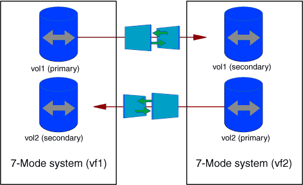

= Scenarios for selecting volumes in a project
:icons: font
:imagesdir: ../media/

[.lead]
Planning a project composition and deciding which 7-Mode volumes to transition in a single transition operation can help in reducing the downtime for applications. Understanding some sample scenarios can help you while creating projects in your environment.

== Bidirectional SnapMirror relationship

To transition a bidirectional SnapMirror relationship, you must create different transition projects for each volume.

For example, as shown in the illustration below, consider a volume SnapMirror relationship that exists between vf1:vol1 (primary) on system1 and vf2:vol1 (secondary) on system2. Similarly, another volume SnapMirror relationship exists between vf2:vol2 (primary) on system2 and vf1:vol2 (secondary) on system1.

You cannot combine the volumes vf1:vol1 and vf1:vol2 in one transition project. Similarly, you cannot combine the volumes vf2:vol1 and vf2:vol2 in one transition project. You must create separate transition projects for each volume to transition the volume SnapMirror relationship.

== Volumes with CIFS configuration

You must group volumes that have CIFS configuration in one project so that all the CIFS-related configuration is transitioned completely to the SVM.

For example, if 10 volumes in a 7-Mode system or a vFiler unit have associated CIFS shares, home-directory search path, and audit configuration, these 10 volumes must be transitioned in one project . This ensures that all the volumes and CIFS configuration are completely applied on the SVM after transition.

== SnapMirror relationship between a primary volume and multiple secondary volumes

If a SnapMirror relationship exists between a primary volume and multiple secondary volumes and if all the secondary volumes are on the same 7-Mode controller, you can create a secondary project to group all the secondary volumes and complete the transition of all secondary volumes in that project. You can then create a primary project to transition the primary volume and complete the SnapMirror transition.
