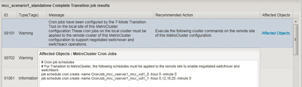

= Configuring cron job schedules on the remote site after transitioning a MetroCluster configuration
:icons: font
:imagesdir: ../media/

[.lead]
The cron job schedules created during transition are not replicated to the remote site, and therefore negotiated switchover fails after transition. You must manually create the cron job schedules on the remote site after transition.

Storage cutover for the 7-Mode active site must have been completed successfully.

.Steps
. Record the cron job messages generated at the storage cutover to identify the job schedules that must be replicated to the remote site.
+

. From the cluster CLI of the remote site, run the `job schedule cron create` commands recorded in <<STEP_F72D5FA759564336A365328A3414D57A,Step 1>>.
