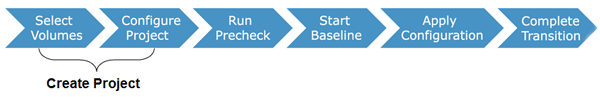

= Migrating data and configuration from 7-Mode volumes
:icons: font
:imagesdir: ../media/

[.lead]
To migrate volumes or a volume SnapMirror relationship by using the 7-Mode Transition Tool, you must first configure projects, start a baseline copy, and complete the projects.

* The 7-Mode controllers and clusters that you want to include in the transition must be reachable from the Windows host where the tool is installed.
* You must have all administrator-level privileges for the controllers and clusters that you want to include in the transition project.
* The 7-Mode Transition Tool service must be running on the machine on which it is installed.
+
The service is set to automatic by default, and should start when you restart the machine.

* You should not perform assessment and migration operations on a controller simultaneously.
* You should not modify the objects (volumes, IP addresses, system information, and so on) on the 7-Mode controllers and clusters after fixing errors and warnings that are reported by precheck.
* You should avoid using multiple web interface sessions that are writing to the same SVM simultaneously to prevent undesired results.
* You should avoid modifying the controller and cluster passwords during the transition process.
* You should avoid using the **Back**and *Forward* browser buttons, as the tool does not support web browser navigation and might cause undesired results.
* You should avoid browser refresh while transition is in progress, because it might cause undesired results.

The following image illustrates the migration process:

*Related information*

xref:concept_how_you_transition_a_stand_alone_volume.adoc[How you transition a stand-alone volume]

xref:concept_how_you_transition_volumes_in_a_snapmirror_relationship.adoc[How you transition volumes in a SnapMirror relationship]
