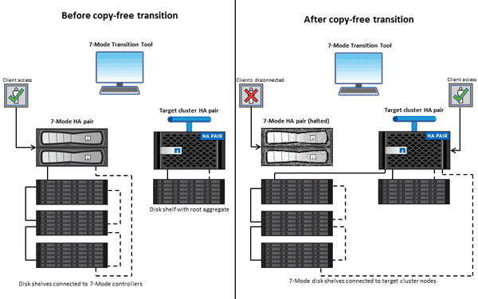

= Copy-free transition by using 7-Mode Transition Tool
:icons: font
:imagesdir: ../media/

[.lead]
The 7-Mode Transition Tool enables you to collect inventory and to assess 7-Mode controllers, hosts, switches, and applications for transition. After assessment, you can use a copy-free transition to migrate your data and configurations to ONTAP. In copy-free transition, you disconnect all the disk shelves from a 7-Mode HA pair and connect them to an HA pair in the target cluster.

Copy-free transition significantly reduces the migration cost by enabling the reuse of 7-Mode disk shelves. The overall duration for performing the transition is faster because data copy is not required.

The unit of a copy-free transition is an HA pair. You must move all the disk shelves from the 7-Mode HA pair to the target cluster nodes.

The metadata of the 7-Mode aggregates and volumes is converted to the ONTAP format by the 7-Mode Transition Tool. The time taken for this conversion does not depend on the size of the aggregates and volumes. For example, the time taken to convert a 10 GB aggregate to the ONTAP format is the same as the time required to convert a 100 TB aggregate.

Copy-free transition involves a disruption to data access. However, the total time taken to perform the data migration is faster because no data copy is required.

The following illustration shows the before and after scenarios for copy-free transition from a 7-Mode HA pair to a two-node cluster:

The 7-Mode Transition Tool runs on a Windows system and provides web interface for managing transition operations.

== Collecting and assessing ONTAP systems, hosts, switches, and applications

You can perform the following collect and assess tasks by using the 7-Mode Transition Tool:

* Collecting inventory information from ONTAP systems (7-Mode controllers and nodes in the cluster), hosts, switches, and host applications.
* Generating the FC Zone plan to configure the zones for SAN FC transition.
* Assessing the features and functionalities of the 7-Mode systems, and identify how these features and functionalities work in the ONTAP version selected for the transition.

== Moving data and configurations from 7-Mode to ONTAP

Copy-free transition reuses the 7-Mode disk shelves to copy 7-Mode data from 7-Mode to ONTAP. You can perform the following tasks by using the 7-Mode Transition Tool for copy-free migration:

* Planning your transition to map the 7-Mode controllers or vFiler units to the target SVMs, and design the namespace.
* Running prechecks to verify the compatibility of the 7-Mode systems and target cluster nodes for transition.
* Importing 7-Mode disk shelves in the following ways:
 ** From a 7-Mode HA pair to a new HA pair in a new cluster
 ** From a 7-Mode HA pair to a new HA pair in an existing cluster that has additional data-serving nodes
 ** From a 7-Mode HA pair to an HA pair that has data aggregates in an existing cluster that is serving data
 ** From an HA pair that contains volumes in a volume SnapMirror relationship to an HA pair in a new or existing cluster
+
You must manually create the cluster peer relationship after transition; however, a rebaseline transfer is not required, and you can retain the SnapMirror relationship after transition.
* Transitioning 7-Mode configurations to SVMs.
+
Copy-free transition supports the transition of NAS and SAN configurations.

* Rolling back storage and configurations to 7-Mode if transition to ONTAP fails.
+
The tool generates the list of steps that are required to roll back to 7-Mode. You must manually perform these rollback steps on the 7-Mode systems and the cluster.
