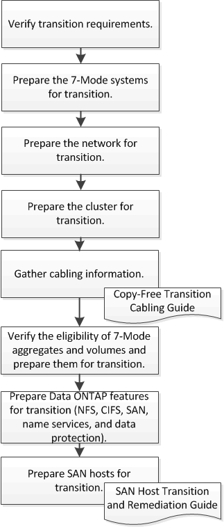

= Preparing for copy-free transition
:icons: font
:imagesdir: ../media/

[.lead]
Before starting the copy-free transition, you must identify the 7-Mode HA pair to transition, understand the requirements and restrictions for migration, and prepare the 7-Mode systems and cluster for transition. You must also be aware of the Data ONTAP features that are supported and unsupported for transition.

*Related information*

https://mysupport.netapp.com/matrix[NetApp Interoperability Matrix Tool]
