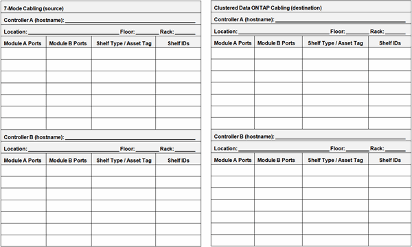

= Copy-free transition cabling worksheet
:icons: font
:imagesdir: ../media/

[.lead]
You can use the copy-free transition cabling worksheet to plan your cabling. You must record information about the ports and disk shelves connected to the 7-Mode controllers and target cluster nodes. You should also record the ports to use for connecting the 7-Mode disk shelves to the target cluster nodes.

* Module A/B Ports: Port connections for module A/B
* Shelf Type/Asset Tag: Disk shelf type
* Shelf IDs: Disk shelf IDs

== Sample cabling worksheet

|===
| 7-Mode cabling| Clustered Data ONTAP cabling
| Controller A (host name): 7hostA| Node A (host name): cluster1-01
| Location: Colorado Floor: Third Rack: 8| Location: Colorado Floor: Fifth Rack: 3
| Module A Ports| Module B Ports| Shelf Type/Asset Tag| Shelf IDs| Module A Ports| Module B Ports| Shelf Type/Asset Tag| Shelf IDs
a|
1a
a|
0a
a|
DS4243/150254-7
a|
10-13
a|
1a
a|
0a
a|
DS4243/174243-2
a|
10-11
a|
1b
a|
0b
a|
DS4243/151205-2
a|
30-37
a|
1b
a|
0b
a|
DS4243/150254-7
a|
20-23
a|
1c (offline)
a|
0c (offline)
a|
n/a
a|
n/a
a|
1c
a|
0c
a|
DS4243/151205-2
a|
30-37
a|
1d
a|
0d
a|
DS4243/143921-4
a|
14-15
a|
1d
a|
0d
a|
DS4243/143921-4
a|
14-15
a|
*Controller B (host name): 7hostB*
a|
*Node B (host name):cluster1-02*
a|
*Location: Colorado Floor: Third Rack: 8*
a|
*Location: Colorado Floor: Fifth Rack: 3*
a|
*Module A Ports*
a|
*Module B Ports*
a|
*Shelf Type/Asset Tag*
a|
*Shelf IDs*
a|
*Module A Ports*
a|
*Module B Ports*
a|
*Shelf Type/Asset Tag*
a|
*Shelf IDs*
a|
1a
a|
0a
a|
DS4243/174263-6
a|
10-13
a|
1a
a|
0a
a|
DS4243/174233-2
a|
10-11
a|
1b (offline)
a|
0b (offline)
a|
n/a
a|
n/a
a|
1b
a|
0b
a|
DS4243/174263-6
a|
20-23
a|
1c
a|
0c
a|
DS4243/174274-9
a|
30-37
a|
1c
a|
0c
a|
DS4243/174274-9
a|
30-37
a|
1d
a|
0d
a|
DS4243/174285-6
a|
14-15
a|
1d
a|
0d
a|
DS4243/174285-6
a|
14-15
|===
