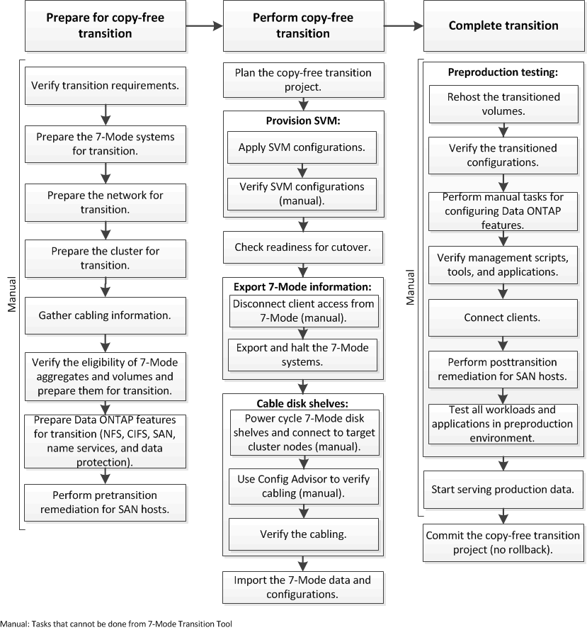

= Copy-free transition workflow
:icons: font
:imagesdir: ../media/

[.lead]
The copy-free transition workflow includes preparing for the transition, performing the transition, and completing the transition. Some of these tasks must be done manually on the 7-Mode systems and the cluster.

