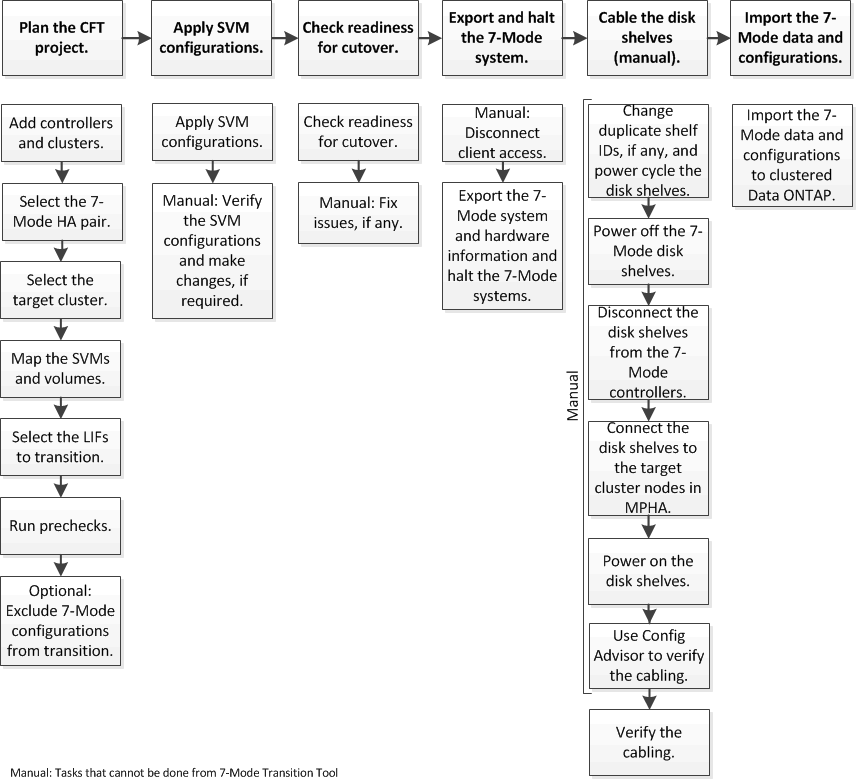

= Transitioning 7-Mode aggregates using copy-free transition
:icons: font
:imagesdir: ../media/

[.lead]
The copy-free transition workflow involves planning a project, applying 7-Mode configurations to the SVMs, exporting the 7-Mode system information and halting the 7-Mode system, manually cabling the disk shelves to cluster nodes, and importing the 7-Mode data and configurations.

You must have prepared the 7-Mode system and the cluster for copy-free transition.

The storage cutover time can be 4-8 hours or less. The cutover time includes the time taken by the tool to perform two automated operations--the export and halt and import operations-- as well as the time taken for manually cabling the disk shelves to the new controllers.

The export and import operations take about 2 hours or less. Cabling can take 2-6 hours or less.
