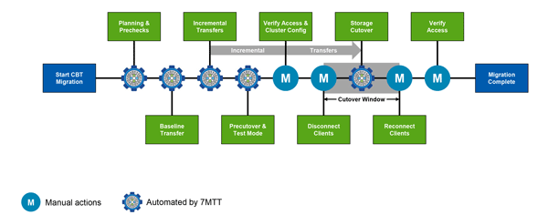

= 7-Mode Transition Tool transition phases
:icons: font
:imagesdir: ../media/

[.lead]
You can use the 7-Mode Transition Tool (7MTT) to perform a copy-free transition (CFT) or a copy-based transition (CBT) from Data ONTAP operating in 7-Mode to clustered Data ONTAP. You must know the phases of each transition method so that you also understand when to perform the specific remediation steps required for your hosts.

The CFT phases are as follows:

image::../media/cft_phases.gif[Copy-free transition phases]

The CBT phases are as follows:

