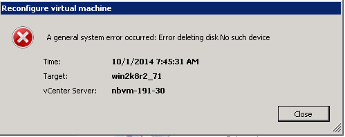

= Removing stale RDMs using vSphere Client
:icons: font
:imagesdir: ../media/

[.lead]
All RDM LUNs become stale during the transition from ONTAP operating in 7-Mode to clustered Data ONTAP. After transition, the RDMs must be removed and reattached before the LUNs can begin servicing data.

You must have the VM name and disk path of the RDM from the _Inventory Assessment Workbook_.

. Open the ESXi host or vCenter Server managing the ESXi host.
. Right-click the VM, and then select *Edit Settings*.
+
The VM Properties window is displayed.

. Select the hard disk from the list of devices using the disk path from the _Inventory Assessment Workbook_.
. Make note of the *Virtual Device Node* and *Compatibility Mode* from the VM Properties window.
+
Virtual Device Node: SCSI 0:2
+
Compatibility Mode: Physical

. Click *Remove*.
. Select *Remove from virtual machine and delete files from disk*.
. Click *OK*.
+
An error message similar to the following appears. You can ignore this message.
+

. Click *Close*.
